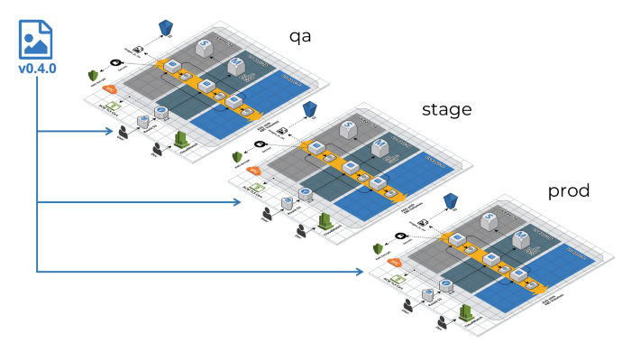

# renovate-test

> Repository to test renovate dependency updates for terraform and terragrunt

## Overview

[Renovate](https://www.whitesourcesoftware.com/free-developer-tools/renovate/)
is [depdendabot](https://dependabot.com/) on steroids.

This repo is not your typical terraform structure, it's best to keep modules in
a separate repo to your config repo. See
[here](https://github.com/gruntwork-io/terragrunt-infrastructure-live-example)
for more info.

The purpose of the repo is to easily test custom config for various terraform
and terragrunt [renovate
managers](https://docs.renovatebot.com/modules/manager/) in one place.

## Setup

The easiest way to use Renovate is to use the GitHub app, see
[here](https://docs.renovatebot.com/install-github-app/) for the deployment
options.

I opted to run it locally to give me more control over when it runs whilst I
experiment:

```sh
npm i -g renovate
export RENOVATE_TOKEN=<my GitHub token>
LOG_LEVEL=debug renovate --autodiscover --autodiscover-filter sajid-khan-js/renovate-test
```

It's also handy to run this after you make changes to your config
(`renovate.json`) `renovate-config-validator` (comes with npm install of
renovate)

## Structure

### [Infra](./infra)

Terragrunt deployment files.

Renovate will bump:

- Upstream module versions e.g.
  `github.com/cloudposse/terraform-null-label?ref=0.24.0`
- `.terraform-version` and `.terragrunt-version` files are used by `tfenv` and
  `tgenv` respectively - Renovate will bump the version numbers in these files
  to the latest respective version

### [Modules](./modules)

Terraform modules/stacks.

Renovate will bump:

- Provider and terraform version pins in specific cases
- Any upstream modules used in the stacks e.g.
  `github.com/cloudposse/terraform-null-label?ref=0.24.0`

#### Terraform version constraint syntax

:memo: Renovate is aware of the [different terraform version
constraints](https://www.terraform.io/docs/language/expressions/version-constraints.html),
meaning it doesn't simply bump versions but actually evaluates whether a bump is
needed. Read more
[here](https://docs.renovatebot.com/modules/manager/terraform/) and
[here](https://docs.renovatebot.com/configuration-options/#rangestrategy)

- `>= 2.0` will not be bumped since this pin allows any newer version than `2.0`
      i.e. at runtime (when you running `terraform init`), terraform will pull
      the latest provider version anyway
- `~> 0.14.4` will be bumped, but since the pessimistic operator is used (`~>`),
  renovate will bump to a version that satisfies this constraint e.g. if the
  latest version is `1.0.4`, bumping to `1.0.0` will still make the stack usable
  by anyone running terraform version `1.0.X`

##### Testing modules

It may seem counterintuitive to use flexible pins (e.g. `~>` or even `=>`) for
modules in the context of testing. In theory, the same tests that run against
the same module may use a different provider:

Given the provider pin like so `version = "~> 2.0"`

- On Monday, tests against `dummy_stack` are run, terraform downloads the latest
  version (`2.1.1`) of the `random` provider.
- On Tuesday, a new version of the `random` provider is released (`2.2.0`)
- On Wednesday, tests are run again, against `dummy_stack`, terraform downloads
  the latest version (`2.2.0`) of the `random` provider.

So, should you use a static pin e.g. `version = "2.1.1"` to ensure the same
provider is always used when testing?

In short, No.

###### In more detail

There is a huge downside to using static pins. Modules that consume your module
will be forced to use the exact same pin. This can be problematic if a module is
consuming multiple modules all with different static pins. It's better to have
some flexibility to save yourself from having to figure out complex dependency
graphs and a convoluted rollout e.g. update module A, then B, then C, rather
than simply update any module in any sequence. In addition, if you consume
community based modules e.g. [these GCP
modules](https://github.com/terraform-google-modules), you have no direct
control over how they pin providers. [HashiCorp themselves recommend the
practice of flexible pins for
providers](https://www.terraform.io/docs/language/expressions/version-constraints.html#terraform-core-and-provider-versions)

###### Mitigation

Although testing in general should limit variables, the purposes of testing
terraform modules is to ensure you don't release a module that's broken. Does
this infra code work with the respective Cloud API? In other words, does my
terraform that is trying to create a storage bucket A) create the bucket B)
configure the bucket as intended by the terraform config?

There is then a slim chance at runtime that your terraform module may not work
with a provider within your range since you may not have tested against it e.g.
`~> 2.0` will allow `2.0.1`, `2.1.0`, `2.2.0` etc.

You should be running `terraform plan` before you run `terraform apply`, and
your `terraform plan` output should be visible and reviewed before `terraform
apply` is run e.g. [atlantis](https://www.runatlantis.io/), [GitHub
actions](https://github.com/dflook/terraform-github-actions/tree/master/terraform-plan).
Doing so negates the slim chance a new `patch` (`0.0.X`) or `major` (`0.X.X`)
version of the provider will break your infra.

Furthermore, module/stacks should be released (i.e. `terraform apply`) in lower
environment first:



### [Renovate config](./renovate.json)

Config file for renovate.

See [here](https://docs.renovatebot.com/configuration-options/) for
configuration options

## Renovate in action

Check out the [close/merged
PRs](https://github.com/sajid-khan-js/renovate-test/pulls?q=is%3Apr+is%3Aclosed)
to see what renovate can do

### Grouping dependency updates

> "Generally, the first reaction people have to automated dependency updates
like Renovate is "oh great/feel the power of automation". The next reaction a
few days or weeks later is often "this is getting overwhelming".Indeed, if you
leave Renovate on its default settings of raising a PR every single time any
dependency receives any update.. you will get a lot of PRs and related
notifications"

The above quote is from [here](https://docs.renovatebot.com/noise-reduction/)

Given this directory structure:

```text
├── infra
│   ├── dev
│   │   └── deployment
│   │       └── terragrunt.hcl
│   └── prd
│       └── deployment
│           └── terragrunt.hcl
├── modules
│   ├── dummy_module
│   │   ├── README.md
│   │   ├── main.tf
│   │   ├── outputs.tf
│   │   ├── variables.tf
│   │   └── versions.tf
│   └── dummy_stack
│       ├── README.md
│       ├── main.tf
│       ├── outputs.tf
│       ├── terraform.tfstate
│       ├── variables.tf
│       └── versions.tf
```

We want to group dependency updates by env (e.g. one PR to update all of `dev`)
and by module/stack (e.g. one PR to update everything in `dummy_stack`).

You can achieve this in Renovate by using `packageRules`. You can group
directories with a static rule e.g.

```json
"packageRules": [
    {
      "groupName": "dev",
      "matchPaths": ["**/infra/dev/**"]
    }
]
```

or by using a dynamic rule e.g.

```json
"packageRules": [
   {
      "groupName": "{{parentDir}}",
      "additionalBranchPrefix": "{{parentDir}}-",
      "matchPaths": ["**/modules/**"]
    }
]
```

Dynamic rules are useful for repos that have a high change rate e.g. a terraform
modules repo where new modules are regularly created, this means you don't have
to remember to create a rule every time you create a new terraform module.
